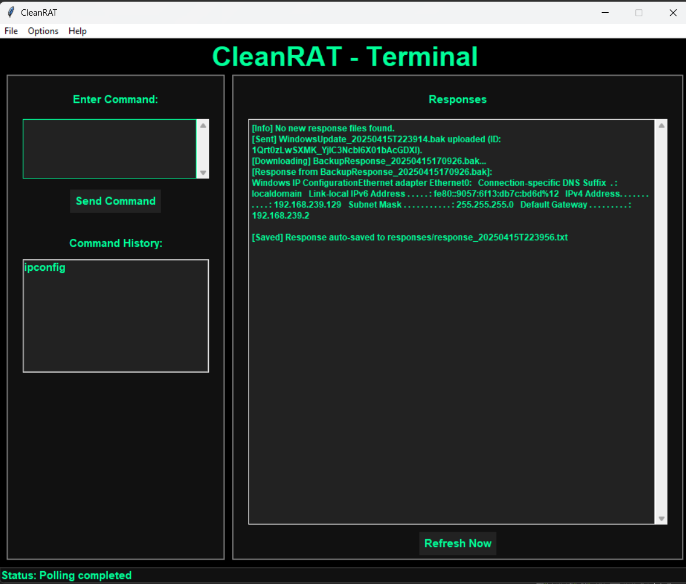
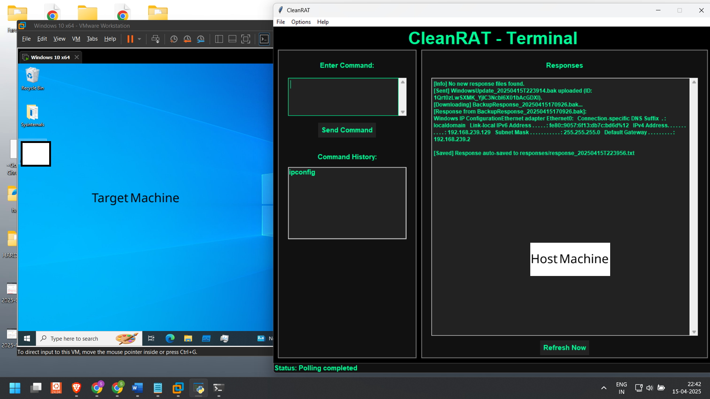

# CleanRAT: Advanced Red Team Simulation Framework

## Abstract

CleanRAT is a **Rust-based** Remote Access Trojan (RAT) designed for realistic red team simulations. It uses **Google Drive** as a covert command-and-control (C2) channel, exchanging encrypted `.bak` command and response files via Drive folders. Key features include AES-encrypted credentials, in-memory decryption, anti-debugging checks, process masquerading, and a self-deletion “wipe-out” command. A Python-based GUI serves as the operator interface, and the initial payload can be deployed via a USB Rubber Ducky to simulate physical attack vectors.

## Features

* **Cloud C2 Channel:** Bidirectional command/response communication over Google Drive folders, with all data encrypted.
* **Embedded Configuration:** C2 parameters (folder IDs, API credentials) are compiled into the binary (no external config files).
* **Credential Obfuscation:** AES-128 encryption of Drive tokens and credentials; keys and blobs are obfuscated at compile time and only decrypted in memory during execution.
* **Anti-Analysis:** No visible console window (Windows GUI subsystem); anti-debug checks (e.g. `IsDebuggerPresent`, memory breakpoints) that terminate if a debugger or analysis tool is detected.
* **Process Masquerading:** The client executable can be renamed (e.g. `WinUpdate32.exe`) or use a custom icon to appear benign.
* **Self-Destruct (“Wipe-Out”):** A special command triggers secure deletion of the executable and cleanup of any temporary files or logs.
* **Python GUI Operator Console:** A decoupled host interface for sending commands and retrieving output, abstracting Drive API details.
* **Hardware Delivery:** Initial payload deployment via USB Rubber Ducky (keystroke injector) to emulate physical compromise.

## Technologies Used

* **Rust (Client):** Core RAT implementation (async networking via *Tokio*, HTTP via *Reqwest*, JSON parsing via *Serde*, encryption via *openssl/aes*, base64, Windows API via *winapi*, etc.).
* **Python (Host GUI):** Operator interface using *PyDrive2* for Google Drive interactions, *cryptography* library for AES, *argparse/time/uuid* for CLI and timing features.
* **Google Drive API:** Drive v3 REST API with JWT-based OAuth2 for secure authentication and file operations.
* **AES Encryption:** Symmetric encryption (AES-128) for securing commands, outputs, and credentials, with keys embedded in the code.

## System Architecture

CleanRAT’s architecture centers on Google Drive as the *only* communication medium. The **C2 Operator** runs a Python GUI that packages commands into encrypted `.bak` files and uploads them to a designated Drive *command folder*. The **RAT Client**, deployed on the target, continuously polls this command folder via the Drive API. When a new command file is detected, the client decrypts and executes it locally. The output is encrypted and uploaded as a `.bak` file to a separate *response folder*, which the GUI then polls.  All operations occur over authenticated Drive API calls (no open TCP ports or direct network connections). This decoupled, asynchronous design ensures high reliability and low visibility, mimicking real-world stealth C2 communication.

## Command Execution Workflow

1. The operator enters a shell command or script in the GUI and sends it. The GUI creates an encrypted `.bak` file and uploads it to the Drive **command folder**.
2. The RAT client polls the command folder at intervals. When a new command file appears, the client downloads and decrypts it.
3. The client executes the command locally (using standard system APIs or spawning processes).
4. The client captures the execution output, encrypts it, and uploads it to the Drive **response folder** as a `.bak` file.
5. The GUI polls the response folder, downloads any output files, decrypts them, and displays the results to the operator. Sent command and received response files are then deleted from Drive to minimize traces.

## GUI Host Interface Usage

* **Command Dispatch:** The operator types a system command into the GUI. The interface encrypts it and uploads it as a `.bak` file to the Google Drive command folder.
* **Result Display:** The GUI continuously polls the Drive response folder. When an encrypted output file is found, the GUI downloads and decrypts it, then shows the command output in the interface.
* **Automatic Cleanup:** After processing, the GUI deletes the `.bak` command and response files from Google Drive, leaving minimal forensic artifacts.
* **Session Management:** The host GUI is decoupled from the client, allowing one GUI instance to control multiple RAT clients by segregating command/response folders.

## Self-Deletion and Stealth Mechanisms

* **Wipe-Out Command:** A special “wipe-out” instruction causes the RAT to spawn a separate process that securely deletes the executable and overwrites any leftover files. All temporary logs and intermediate files are removed before the client terminates.
* **Anti-Debugging:** The client includes runtime checks (e.g. `IsDebuggerPresent`, scanning for breakpoints or analysis tools) that immediately halt execution if a debugger is detected.
* **Console-Less Execution:** Compiled for the Windows GUI subsystem, the RAT runs without any visible console window.
* **Process Masquerading:** The executable can be renamed (e.g. using a common system-update process name) and uses a custom icon to appear legitimate.
* **Embedded Credentials:** All sensitive data (API tokens, folder IDs, encryption keys) is encrypted and embedded in the binary (using Rust’s `include_str!()`), avoiding external config files that could raise suspicion.
* **Minimal Footprint:** The RAT leaves no scheduled tasks or registry entries by default; any temporary files are deleted immediately after use. These measures collectively create a stealthy operational profile similar to real advanced malware.

## Security Considerations

CleanRAT is intended for controlled red team or lab environments. **Least-privilege:** Ensure the Google service account has only the necessary Drive scopes and access to the specific folders (no broader permissions). **Encrypted Channels:** All communications use AES encryption and OAuth2 tokens that auto-refresh at runtime, reducing static indicators. Because CleanRAT uses only authenticated API calls (no listening ports), monitoring should focus on unusual Drive activity or service account usage. Operators should secure the service account key and the compiled binary; signing the executable and using hardened token scopes is recommended. Additionally, disable internet access on production hosts when running the client outside of test scenarios to prevent accidental leakage.

## Future Enhancements

* **Multi-Client Orchestration:** Extend the framework to manage multiple simultaneous RAT clients. Each client would use unique identifiers and encryption keys, with segregated folders or subfolders for commands and responses.
* **Alternate C2 Channels:** Support additional cloud services (e.g., Dropbox, OneDrive) or custom APIs to diversify covert channels.
* **Event-Driven C2:** Implement real-time messaging or live shells instead of polling (e.g., webhooks, push notifications) for faster responsiveness.
* **In-Memory & Fileless Execution:** Enable payloads and commands to run entirely in memory without touching disk, and add advanced injection techniques.
* **Cryptographic Hardening:** Use stronger cipher modes (e.g., AES-GCM), rotating keys, and message authentication to improve confidentiality and integrity.
* **Extensible Post-Exploitation Modules:** Develop plugins for data exfiltration, persistence (e.g., registry or service), or privilege escalation.
* **Cross-Platform Support:** Port the client to Linux/macOS or integrate with other languages to increase compatibility. Pursuing these directions will broaden CleanRAT’s capabilities as a versatile red team toolkit.

## Screenshots
### Host Side GUI – Sending Commands

### RAT Client Execution on Target and command execution

